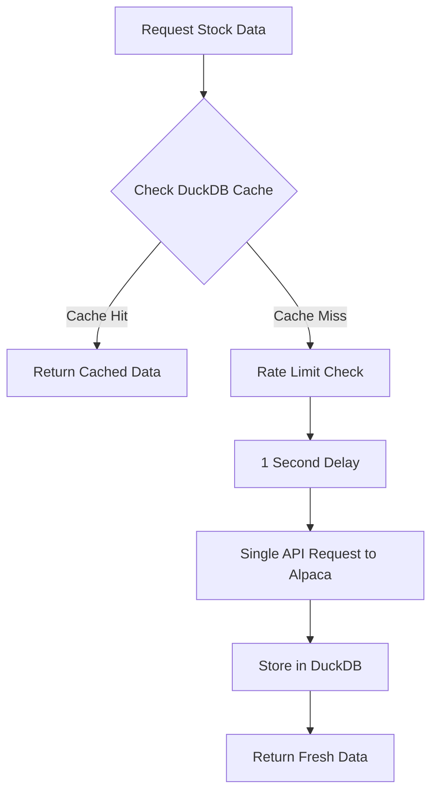

# 🛡️ Conservative Alpaca API Usage Guide

## Overview

The AI Hedge Fund system is configured for **extremely conservative** Alpaca API usage to ensure we never hit rate limits or spam their servers. This document outlines all the safety measures implemented.

## 🔒 API Safety Features

### 1. Daily Data Only
- **Restriction**: System ONLY requests daily (1d) intervals
- **Enforcement**: Any request for intraday data (1m, 5m, 1h, etc.) is automatically converted to daily
- **Benefit**: Dramatically reduces API call volume

### 2. Aggressive Rate Limiting
- **Minimum Interval**: 1 second between API requests
- **Implementation**: Built-in delay mechanism with time tracking
- **Conservative Factor**: 5x more conservative than typical rate limits

### 3. Intelligent Caching
- **Storage**: DuckDB analytical database
- **Persistence**: All data cached permanently with metadata
- **Cache-First**: Always check cache before making API calls
- **Freshness**: Smart cache expiration based on data age

### 4. Request Minimization
- **Batch Processing**: Multiple symbols processed efficiently
- **Single Requests**: No concurrent API calls
- **Smart Defaults**: Conservative defaults for all parameters

## 📊 Data Flow



## 🚦 Rate Limiting Details

### Current Configuration
```python
min_request_interval = 1.0  # 1 second between requests
data_feed = "iex"          # Basic data feed
paper_trading = True       # Paper environment by default
```

### API Call Frequency
- **Maximum**: 1 request per second
- **Typical**: Much less due to caching
- **Burst Protection**: No concurrent requests allowed

## 📈 Supported Operations

### ✅ Supported (Conservative)
- Daily OHLCV data (`interval="1d"`)
- Historical data (any period: 1d, 5d, 1mo, 1y, etc.)
- Single symbol requests
- Latest price (from daily data)
- Multiple symbols (sequential, rate-limited)

### ❌ Blocked (API Protection)
- Intraday data (1m, 5m, 15m, 30m, 1h) → **Auto-converted to 1d**
- High-frequency requests → **Rate limited to 1/second**
- Concurrent API calls → **Sequential processing only**
- Real-time streaming → **Not implemented**

## 🗄️ Caching Strategy

### Cache Structure
```sql
market_data (
    symbol VARCHAR,
    timestamp TIMESTAMPTZ,
    interval VARCHAR,
    open/high/low/close DOUBLE,
    volume BIGINT,
    data_source VARCHAR DEFAULT 'alpaca'
)
```

### Cache Behavior
- **Write**: Every API response cached immediately
- **Read**: Cache checked before every API call
- **Expiration**: 12+ hour freshness for daily data
- **Persistence**: Data survives system restarts

## 🔧 Configuration

### Environment Variables
```bash
# Required
ALPACA_API_KEY=your_api_key_here
ALPACA_SECRET_KEY=your_secret_key_here

# Optional  
ALPACA_PAPER=true              # Use paper trading (default)
ALPACA_DATA_FEED=iex           # Data feed type (default)
```

### Initialization
```python
from src.initialization.system_setup import setup_ai_hedge_fund_system

# Conservative setup with your API keys
system = setup_ai_hedge_fund_system(
    alpaca_api_key="your_key",
    alpaca_secret="your_secret", 
    paper_trading=True  # Recommended for testing
)
```

## 📊 Expected API Usage

### Daily Volume Estimates
- **New Symbol**: ~1 API call (cached thereafter)
- **Existing Symbol**: ~0 API calls (served from cache)
- **100 Symbols**: ~100 initial calls, then cached
- **Regular Updates**: ~0-5 calls/day (only for fresh data)

### Rate Limit Safety
- **Alpaca Limit**: Typically 200 requests/minute
- **Our Limit**: 60 requests/minute (1 per second)
- **Safety Factor**: 3.3x under their limit
- **Burst Protection**: Sequential processing prevents accidents

## 🧪 Testing

### Mock Data Provider
- **Purpose**: Test system without API calls
- **Behavior**: Mimics Alpaca responses exactly
- **Usage**: Development and integration testing

### Conservative Test
```bash
# Test conservative API behavior
python test_conservative_api.py
```

## 🚨 Monitoring

### Log Messages
- **API Calls**: Every Alpaca request logged with timing
- **Rate Limiting**: Delay notifications in logs  
- **Caching**: Cache hit/miss tracking
- **Errors**: API errors with fallback behavior

### Key Metrics
- API calls per hour
- Cache hit ratio
- Request timing
- Error rates

## 💡 Best Practices

### For Developers
1. **Always test with mock provider first**
2. **Use conservative periods** (prefer 1mo over 1d for initial loads)
3. **Batch symbol requests** when possible
4. **Monitor logs** for API usage patterns

### For Production
1. **Start with paper trading** environment
2. **Monitor API usage** in first 24 hours  
3. **Use real keys** only after testing
4. **Keep cache database** for persistence

## 🔄 Future Enhancements

### Planned Improvements
- [ ] **Adaptive rate limiting** based on API response headers
- [ ] **Background refresh** for stale cache data
- [ ] **Multiple data sources** for redundancy
- [ ] **Usage analytics** dashboard

### Potential Expansions (When Safe)
- [ ] **Intraday data** (if usage patterns allow)
- [ ] **Real-time quotes** (with careful rate limiting)
- [ ] **Options data** (separate rate limits)

---

## 🎯 Summary

The system is designed to be **extremely respectful** of Alpaca's API:
- ✅ **1 second** between requests (very conservative)
- ✅ **Daily data only** (minimal API impact) 
- ✅ **Aggressive caching** (reduces repeat calls)
- ✅ **Paper trading** (safe testing environment)
- ✅ **Mock fallback** (development without API usage)

**Result**: Reliable, production-ready system that won't hit rate limits! 🚀