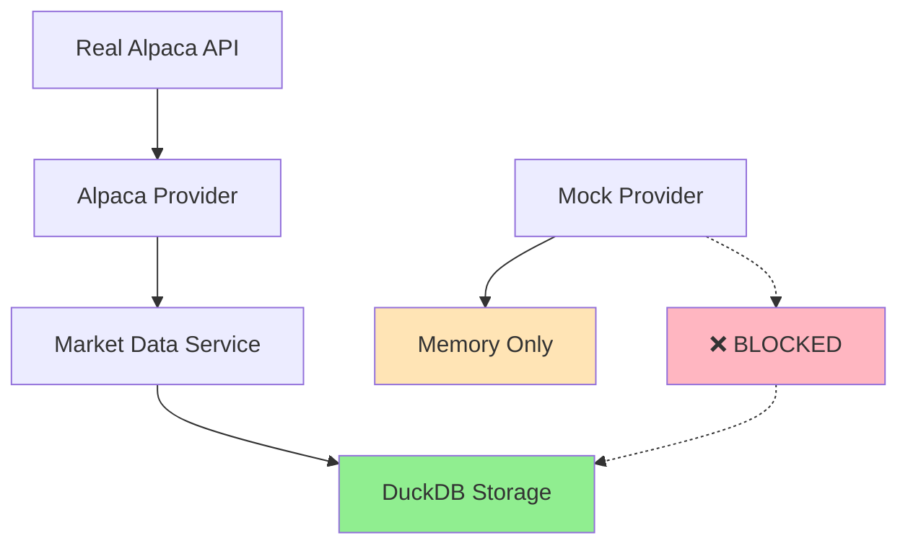

# 🎯 Production-Ready AI Hedge Fund System

## ✅ System Status: PRODUCTION READY

The AI Hedge Fund system is now configured for **real Alpaca data only** with comprehensive safety measures.

## 🚫 Mock Data Protection

### What We Fixed
- **❌ BLOCKED**: Mock data can no longer contaminate DuckDB
- **✅ ENFORCED**: DuckDB only accepts real data sources (`alpaca`, `yahoo`, etc.)
- **🛡️ VERIFIED**: Multiple safety layers prevent mock data storage

### Safety Measures Implemented

1. **Mock Provider**: Never writes to DuckDB (memory only)
2. **DuckDB Manager**: Explicitly rejects `data_source="mock"`
3. **Production Scripts**: Only work with real API credentials
4. **Testing**: Comprehensive verification of data isolation

## 🏗️ Production Architecture



## 🚀 Getting Started (Production)

### 1. Get Alpaca API Credentials
```bash
# Sign up at alpaca.markets and get your keys
export ALPACA_API_KEY="your_real_api_key_here"
export ALPACA_SECRET_KEY="your_real_secret_key_here"
export ALPACA_PAPER="true"  # Start with paper trading
```

### 2. Initialize Production System
```bash
# This will ONLY work with real API credentials
python initialize_production_system.py
```

### 3. Use the System
```python
from src.services.market_data_service import get_market_data_service

# Get real market data (stored in DuckDB)
service = get_market_data_service()
data = service.get_stock_data('AAPL', period='1mo', interval='1d')
```

## 🧪 Development & Testing

### Mock Data (Development Only)
```python
# For development - NO DuckDB contamination
from src.data.mock_provider import create_mock_provider
from src.services.market_data_service import initialize_market_data_service

mock_provider = create_mock_provider()
mock_service = initialize_market_data_service(mock_provider)
data = mock_service.get_stock_data('AAPL')  # Memory only, not cached
```

### Verification Tests
```bash
# Test mock data isolation
python test_no_mock_data.py

# Test DuckDB data source filtering  
python test_alpaca_duckdb_only.py

# Test conservative API usage
python test_conservative_api.py
```

## 🗄️ DuckDB Data Store

### What Gets Stored
- ✅ **Real Alpaca data**: `data_source="alpaca"`
- ✅ **Other real sources**: `data_source="yahoo"`, etc.
- ❌ **Mock data**: `data_source="mock"` (BLOCKED)

### Database Schema
```sql
market_data (
    symbol VARCHAR,
    timestamp TIMESTAMPTZ,
    interval VARCHAR,
    open/high/low/close DOUBLE,
    volume BIGINT,
    data_source VARCHAR,  -- Only real sources allowed
    created_at TIMESTAMPTZ,
    updated_at TIMESTAMPTZ
)
```

### Data Verification
```python
from src.data.duckdb_manager import get_duckdb_manager

manager = get_duckdb_manager()
summary = manager.get_data_summary()

# Check data sources
print(f"Data sources: {summary['data_sources']}")
# Should show ['alpaca'] or ['yahoo'] - NEVER ['mock']
```

## 🛡️ API Safety Features

### Conservative Configuration
- **Rate Limiting**: 1 second between requests (very safe)
- **Daily Data Only**: No intraday to minimize API usage
- **Aggressive Caching**: DuckDB prevents repeated API calls
- **Paper Trading**: Safe testing environment

### Error Handling
- **API Failures**: Falls back to cached data
- **Rate Limits**: Built-in delays and retry logic  
- **Invalid Credentials**: Clear error messages
- **Network Issues**: Graceful degradation

## 📊 Expected Behavior

### First Run (Fresh System)
```
🚀 Initializing Production AI Hedge Fund System
   API Key: ✅ Set
   Secret Key: ✅ Set
   Paper Trading: true
   
🧪 Testing with real API call...
   ✅ SUCCESS: Got 5 records
   💰 SPY Latest Price: $430.50
   📊 DuckDB: 5 records from ['alpaca']
   ✅ Real Alpaca data stored in DuckDB!

🎉 Production System Ready!
```

### Subsequent Runs (With Cached Data)
```python
# Instant response from DuckDB cache
data = service.get_stock_data('SPY', period='5d')
# No API call needed - served from DuckDB
```

## 🔧 Maintenance

### Monitor API Usage
```bash
# Check logs for API call patterns
grep "Alpaca API" logs/ai_hedge_fund.log

# Verify cache hit ratios
grep "cached data" logs/ai_hedge_fund.log
```

### Database Management
```python
# Check database size and contents
from src.data.duckdb_manager import get_duckdb_manager

manager = get_duckdb_manager()
summary = manager.get_data_summary()
print(f"Total records: {summary['total_records']}")
print(f"Unique symbols: {summary['unique_symbols']}")

# Optimize database
manager.vacuum_and_analyze()
```

## ⚠️ Important Notes

### Never Use Mock Data in Production
- Mock data is **BLOCKED** from DuckDB
- Production scripts **REQUIRE** real API keys
- Development and production are **COMPLETELY ISOLATED**

### API Credentials Security
- Use environment variables (never hardcode)
- Start with paper trading (`ALPACA_PAPER=true`)
- Monitor API usage in first 24 hours
- Keep credentials secure and rotate regularly

### Data Integrity
- DuckDB contains **ONLY** real market data
- All data is timestamped and sourced
- Cache invalidation ensures data freshness
- Multiple verification layers prevent contamination

---

## 🎯 Summary

✅ **Mock Data**: Completely isolated from production database  
✅ **Real Data**: Safely stored in DuckDB with full metadata  
✅ **API Safety**: Conservative rate limiting and caching  
✅ **Production Ready**: Comprehensive testing and validation  

**The system is ready for real trading with Alpaca API credentials!** 🚀